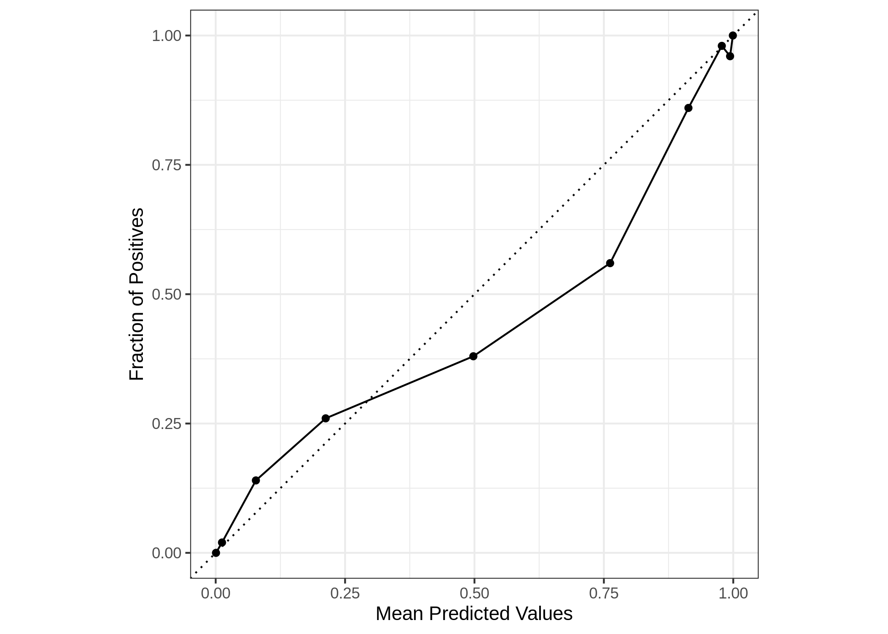

<!-- README.md is generated from README.Rmd. Please edit that file -->

# calibcurve

<!-- badges: start -->

<!-- badges: end -->

`calibcurve` implements functions to compute true and predicted
probabilities and visualise a calibration curve, aka reliability diagram
([Niculescu-Mizil & Caruana,
2005](https://dl.acm.org/doi/10.1145/1102351.1102430)).

  - `calibcurve` is powered by the
    `[yardstick](https://yardstick.tidymodels.org/index.html)`’s
    infrastructure and its implementation of related curve metrics.

  - `calibcurve` borrowed some ideas from sklearn’s
    [calibration](https://scikit-learn.org/stable/modules/generated/sklearn.calibration.calibration_curve.html#sklearn.calibration.calibration_curve)
    module.

## Installation

You can install the released version of calibcurve from
[CRAN](https://CRAN.R-project.org) with:

``` r
# install.packages("calibcurve")
# Not yet!
```

And the development version from [GitHub](https://github.com/) with:

``` r
# install.packages("devtools")
devtools::install_github("chuvanan/calibcurve")
```

## Example

This is a basic example which shows you how to solve a common problem:

``` r
library(calibcurve)
library(magrittr)
library(ggplot2)

data(two_class_example, package = "yardstick")
head(two_class_example)
#>    truth      Class1       Class2 predicted
#> 1 Class2 0.003589243 0.9964107574    Class2
#> 2 Class1 0.678621054 0.3213789460    Class1
#> 3 Class2 0.110893522 0.8891064779    Class2
#> 4 Class1 0.735161703 0.2648382969    Class1
#> 5 Class2 0.016239960 0.9837600397    Class2
#> 6 Class1 0.999275071 0.0007249286    Class1

two_class_example %>%
    calibration_curve(truth, Class1)
#> # A tibble: 10 x 2
#>    .mean_predicted .frac_positive
#>              <dbl>          <dbl>
#>  1        0.000626           0   
#>  2        0.0122             0.02
#>  3        0.0777             0.14
#>  4        0.213              0.26
#>  5        0.498              0.38
#>  6        0.762              0.56
#>  7        0.913              0.86
#>  8        0.978              0.98
#>  9        0.994              0.96
#> 10        0.999              1

two_class_example %>%
    calibration_curve(truth, Class1) %>%
    autoplot()
```



## Code of Conduct

Please note that the calibcurve project is released with a [Contributor
Code of
Conduct](https://contributor-covenant.org/version/2/0/CODE_OF_CONDUCT.html).
By contributing to this project, you agree to abide by its terms.
